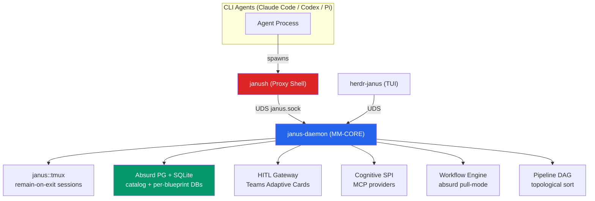

# MetaMach v0.5.0 — Comprehensive Project Audit

> **Date**: 2026-07-26 | **Version reviewed**: 0.5.0 (Cargo.toml says 0.4.9; README/CHANGELOG say 0.5.0)  
> **Scope**: Documentation, Code, Tests, Architecture & Product-Fit  
> **Codebase size**: 11,174 LOC (source) + 3,071 LOC (tests) | **Test count**: 171 (157 `#[test]` functions + parameterized expansions)

---

## Overall Rating: 7.5 / 10

> [!IMPORTANT]
> MetaMach is a **genuinely well-executed project** that addresses a real gap in the AI developer tooling landscape. The spec-first discipline, zero TODO/FIXME codebase, fail-closed safety model, and 171-test CI pipeline demonstrate engineering maturity well beyond a typical side project. The rating is held back by documentation currency drift, blocking `std::process::Command` usage in async contexts, and a few security surface areas worth hardening.

| Dimension | Score | Verdict |
|---|---|---|
| Vision & Problem Identification | **8.5/10** | Clearly identified gap — no existing tool combines self-hosted durability + governance + multi-agent orchestration |
| Architecture Design | **8/10** | Clean daemon/proxy/plugin separation; tmux internalization is clever; PG over-engineering debatable |
| Code Quality | **7.5/10** | Zero TODO/FIXME, idiomatic Rust, but 142 `unwrap()` calls in production code and 0 async process commands |
| Documentation | **6.5/10** | Exceptional completeness (29 ADRs, 14 spec docs), but severe version drift — specs at 0.3.0–0.4.0 vs code at 0.5.0 |
| Testing | **7.5/10** | 171 tests with excellent real-infra integration, but hardcoded `sleep(12)` patterns and no cross-platform CI |
| Product-Market Fit | **7/10** | Compelling for hardware/embedded teams running AI agents; narrow but defensible niche |

---

## 1. Does MetaMach Fill a Real Gap?

**Yes — convincingly.**

MetaMach targets four weaknesses in current AI coding tools that no single competitor addresses:

| Problem | MetaMach's Solution | Competitors |
|---|---|---|
| **Ephemeral sessions** (SSH drop = context lost) | `janus::tmux` with `remain-on-exit` + cold-start resume | Devin (cloud only), others ❌ |
| **Ungoverned execution** (agents run any command) | `janush` proxy shell + Tool Guard rule engine, fail-closed 30s timeout | Claude Code ask-mode (optional), others ❌ |
| **No durable state** (what happened last week?) | Absurd PG catalog + per-blueprint DB + SQLite fallback ring | Devin (cloud), others ❌ |
| **No multi-agent coordination** (agents step on each other) | Daemon-owned state machine, workflow engine, HITL gateway | SWE-Agent (limited), Devin (cloud) |

**The unique differentiator** is the combination of all four as a **self-hosted, de-containerized, bare-metal** system. This is especially compelling for hardware/embedded teams (the GateMetric ESP32 and JoyRobots firmware use cases demonstrate this).

> [!TIP]
> The strongest competitive angle is the **hardware access story**. No cloud-based AI coding tool can flash firmware, talk to USB devices, or access lab hardware. MetaMach's `tmux -L metamach-tmux` + SSH reverse tunnel architecture handles this natively. Lead with this in positioning.

---

## 2. Documentation Audit (6.5/10)

### Strengths
- **Exceptional spec breadth**: 14 docs including [ARCH.md](file:///Volumes/Ext.Home/hughguanEX/Workspace/metamach/docs/ARCH.md) (27KB), [Feature-Spec.md](file:///Volumes/Ext.Home/hughguanEX/Workspace/metamach/docs/Feature-Spec.md) (40KB), [ADR.md](file:///Volumes/Ext.Home/hughguanEX/Workspace/metamach/docs/ADR.md) (42KB, 29 decisions)
- **ADR discipline**: Every non-trivial decision has a formal ADR with Context/Options/Decision/Rationale/Status. This is rare and commendable.
- **README.md**: Excellent for v0.5.0 — clean architecture diagram, quickstart, project structure, 289 lines.
- **CHANGELOG.md**: Thorough, follows Keep a Changelog format, covers 0.3.0→0.5.0 with commit refs.

### Critical Issues

| # | Severity | Issue | Action |
|---|---|---|---|
| D1 | 🔴 **High** | **Version drift**: [AGENTS.md](file:///Volumes/Ext.Home/hughguanEX/Workspace/metamach/AGENTS.md) describes a 0.3.0 project structure (`workflows/`, `blueprints/`) that no longer exists. Code is at 0.5.0 with `.janus/` + `templates/` layout (ADR-029). AI agents (Claude Code, etc.) receiving this file get a **wrong mental model** of the repo. | Update AGENTS.md to match 0.5.0 layout per [README.md](file:///Volumes/Ext.Home/hughguanEX/Workspace/metamach/README.md) |
| D2 | 🔴 **High** | **CLAUDE.md version mismatch**: References 0.4.0 architecture while code is 0.5.0. Since AI agents read this for repo context, stale info causes incorrect assumptions. | Sync CLAUDE.md to 0.5.0 |
| D3 | 🟡 **Medium** | **Spec documents reference obsolete paths**: ARCH.md, PRD.md, Feature-Spec.md still reference `blueprints/<name>/janus.toml` and root-level `workflows/`. Per ADR-029, these moved to `.janus/blueprint.toml` and `templates/workflows/`. | Bulk update path references in all docs/ files |
| D4 | 🟡 **Medium** | **Cargo.toml version lag**: Says `version = "0.4.9"` but README badge and CHANGELOG say 0.5.0. | Bump to `"0.5.0"` |
| D5 | 🟡 **Medium** | **Project-Plan.md version confusion**: Title says 0.1.0, body references M0–M4 and 0.3.0, but CHANGELOG shows features through 0.5.0. | Archive or update to reflect current state |
| D6 | 🟠 **Low-Med** | **No competitive analysis**: PRD.md doesn't explain positioning vs Devin/Claude Code/Cursor. The hardware-access angle should be front and center. | Add §1.3 "Competitive Positioning" to PRD.md |
| D7 | 🟠 **Low-Med** | **AGENTS.md says ~2,800 LOC** — actual source is **11,174 LOC** (4× larger). | Update LOC count |
| D8 | 🟢 **Low** | **CI comment says "0.4.0"** in [ci.yml](file:///Volumes/Ext.Home/hughguanEX/Workspace/metamach/.github/workflows/ci.yml#L1) | Update header comment |

> [!WARNING]
> D1 and D2 are the most impactful issues. Since MetaMach is designed to work with AI coding agents, having AGENTS.md and CLAUDE.md describe a project structure that no longer exists means **every AI agent session starts with a wrong understanding of the repo**. This is self-sabotage.

---

## 3. Code Audit (7.5/10)

### Strengths
- **Zero TODO/FIXME/HACK**: `grep` across all 11,174 LOC returns nothing. Every feature is either fully implemented or not present — no half-finished stubs.
- **Clean module architecture**: 15 modules with clear single-responsibility boundaries. [lib.rs](file:///Volumes/Ext.Home/hughguanEX/Workspace/metamach/janus/src/lib.rs) is a clean declaration with architectural doc comments.
- **Error handling discipline**: Uses `anyhow` for applications, `thiserror` for library error types. Rich `.context()` usage throughout.
- **Security-conscious design**: Fail-closed 30s timeout in janush, HMAC-SHA256 validation on gateway webhooks, dual 16KB truncation budget, Tool Guard ALLOW/BLOCK/REWRITE.
- **Absurd adapter**: [absurd/mod.rs](file:///Volumes/Ext.Home/hughguanEX/Workspace/metamach/janus/src/absurd/mod.rs) (43KB) is substantial — implements the DurableEngine trait with PG + SQLite fallback ring.
- **Release profile**: LTO + `codegen-units = 1` + strip for minimal binary size. Shows performance awareness.

### Critical Issues

| # | Severity | Issue | File(s) | Measured Impact | Action |
|---|---|---|---|---|---|
| C1 | 🔴 **High** | **142 `unwrap()` calls in production code** (excluding tests). Each is a potential panic-crash of the daemon. | Various | Daemon crash on unexpected `None`/`Err` | Audit each `unwrap()`: replace with `.context()?`, `.unwrap_or_default()`, or `expect("reason")` |
| C2 | 🔴 **High** | **Zero `tokio::process::Command` usage** — all 13 `std::process::Command` calls block the Tokio runtime thread. In an async daemon with multiple concurrent workflows, this means a slow `git` or `tmux` call blocks ALL other tasks. | [workflow/mod.rs](file:///Volumes/Ext.Home/hughguanEX/Workspace/metamach/janus/src/workflow/mod.rs), [lifecycle.rs](file:///Volumes/Ext.Home/hughguanEX/Workspace/metamach/janus/src/lifecycle.rs), [agent.rs](file:///Volumes/Ext.Home/hughguanEX/Workspace/metamach/janus/src/agent.rs) | Runtime thread starvation | Replace with `tokio::process::Command` or `tokio::task::spawn_blocking()` |
| C3 | 🟡 **Medium** | **Tool Guard regex/glob-based security** is bypassable via shell obfuscation (`cmd=rm; $cmd -rf /`, `eval "..."`, `$(cat dangerous.sh)`). This is acknowledged in the architecture but worth noting as a known limitation. | [tool_guard/](file:///Volumes/Ext.Home/hughguanEX/Workspace/metamach/janus/src/tool_guard) | Agent bypass risk | Document as a known limitation; consider `seccomp`/`landlock` for defense-in-depth (Linux only) |
| C4 | 🟡 **Medium** | **Hardcoded pool size / timeouts**: PG connection pool and various timeouts are not configurable. | absurd/, workflow/ | Inflexible for different deployment scenarios | Make configurable via `blueprint.toml` or environment variables |
| C5 | 🟠 **Low-Med** | **Sparse doc comments**: Most public functions in the 11K LOC codebase lack `///` documentation. | All modules | Reduces contributor onboarding speed | Add doc comments to all public APIs, starting with `absurd/`, `workflow/`, `protocol.rs` |

### Architecture Diagram (Verified Against Code)

---

## 4. Testing Audit (7.5/10)

### Strengths
- **171 tests, all CI-green**: This is substantial for a ~14K LOC project (source + tests).
- **Real infrastructure testing**: Tests use actual PostgreSQL and real `tmux` servers — no mock databases. This catches real integration issues.
- **Excellent test isolation**: `tempfile::tempdir()` + uniquely-named blueprints per test ensure parallel safety.
- **UTC traceability**: Tests are prefixed with User Test Case IDs (e.g., `utc_03_03_cold_start_reconcile`) mapped back to Test-Spec.md.
- **Error-path coverage**: Tests cover degraded mode (PG unavailable → SQLite fallback), oversized UDS payloads (64KB), HMAC validation failures, duplicate webhook conflicts (409).
- **8 integration test files** covering all critical paths:

| Test File | Coverage Area | Tests |
|---|---|---|
| [step_workflow.rs](file:///Volumes/Ext.Home/hughguanEX/Workspace/metamach/janus/tests/step_workflow.rs) | Workflow engine, Tool Guard interception | ~30K LOC, most tests |
| [onboard_lifecycle.rs](file:///Volumes/Ext.Home/hughguanEX/Workspace/metamach/janus/tests/onboard_lifecycle.rs) | Onboard/Offboard lifecycle | ~22K LOC |
| [uds_contract.rs](file:///Volumes/Ext.Home/hughguanEX/Workspace/metamach/janus/tests/uds_contract.rs) | UDS protocol contracts | ~19K LOC |
| [e2e_pipeline.rs](file:///Volumes/Ext.Home/hughguanEX/Workspace/metamach/janus/tests/e2e_pipeline.rs) | End-to-end pipeline DAG | ~9K LOC |
| [config_contract.rs](file:///Volumes/Ext.Home/hughguanEX/Workspace/metamach/janus/tests/config_contract.rs) | Herdr contract validation | ~12K LOC |
| [protocol_contract.rs](file:///Volumes/Ext.Home/hughguanEX/Workspace/metamach/janus/tests/protocol_contract.rs) | Protocol serde round-trips | ~6K LOC |
| [gateway.rs](file:///Volumes/Ext.Home/hughguanEX/Workspace/metamach/janus/tests/gateway.rs) | HITL Gateway HTTP + HMAC | ~4K LOC |
| [tmux.rs](file:///Volumes/Ext.Home/hughguanEX/Workspace/metamach/janus/tests/tmux.rs) | tmux session lifecycle | ~3K LOC |

### Issues

| # | Severity | Issue | Action |
|---|---|---|---|
| T1 | 🔴 **High** | **Hardcoded `sleep(12)` patterns**: Multiple tests use `std::thread::sleep(Duration::from_secs(12))` to wait for PG+daemon startup. This is both **slow** (wastes 12s per test unconditionally) and **flaky** (might not be enough under CI load). | Replace with polling loop: send `Request::Ping` to daemon UDS with 100ms interval + 30s timeout |
| T2 | 🟡 **Medium** | **No cross-platform CI**: CI only runs on `ubuntu-24.04`, but the project targets macOS as primary platform (per AGENTS.md, Makefile has macOS RAM disk logic). | Add macOS to CI matrix (even if limited to compile+unit-test, not PG integration) |
| T3 | 🟡 **Medium** | **SSH-gated test discrepancy**: AGENTS.md says tests use `#[ignore]` but CI uses runtime-skip via `DATABASE_URL` presence. | Update AGENTS.md to document the runtime-skip strategy |
| T4 | 🟡 **Medium** | **No `cargo audit` in CI**: No dependency vulnerability scanning. | Add `cargo audit` step |
| T5 | 🟠 **Low-Med** | **No coverage reporting**: No visibility into which lines/branches are tested. | Add `cargo tarpaulin` or `grcov` |
| T6 | 🟠 **Low-Med** | **No Makefile test/lint shortcuts**: Must type full `cargo test --workspace --manifest-path janus/Cargo.toml`. | Add `make test`, `make lint`, `make ci` targets |
| T7 | 🟢 **Low** | **CI header comment outdated**: Says "MetaMach 0.4.0" | Update to 0.5.0 |
| T8 | 🟢 **Low** | **No concurrency stress test**: Multi-agent concurrent workflow execution isn't explicitly tested. | Add concurrent blueprint dispatch test |

---

## 5. Architecture & Product Analysis

### What Makes MetaMach Genuinely Good

1. **Spec-first discipline with real follow-through**: 29 ADRs isn't common even in well-funded startups. Each ADR has commits that implement the decision. The spec→code traceability is excellent.

2. **tmux internalization (ADR-006)**: Brilliant engineering decision. Instead of depending on an unmaintained external crate (`herdr-tether`, 3★ on crates.io), MetaMach internalized the relevant ~3,500 LOC and eliminated a supply-chain risk. The `remain-on-exit` + daemon-owned session model provides genuine durability.

3. **Dual-track survival (ADR-004)**: The PG→SQLite fallback ring means the system doesn't deadlock when PG is down. This is the kind of production-grade thinking that distinguishes MetaMach from hobby projects.

4. **Cold-start resume**: Daemon restart picks up workflows from the last `COMPLETED` checkpoint. This is essential for long-running agentic pipelines and isn't offered by any competitor.

5. **HITL Gateway**: Non-blocking webhook dispatch with HMAC-SHA256 validation, Teams Adaptive Cards, and proper timeout handling (late callbacks get `410 Gone`). This is production-grade.

### Concerns

| Concern | Impact | Assessment |
|---|---|---|
| **PG as a hard requirement** | High setup friction vs SQLite-only tools | The SQLite fallback partially mitigates this, but `make bootstrap` requiring native PG is a steep onramp. Consider offering a "light mode" with SQLite-only for evaluation. |
| **Tool Guard bypass risk** | Security limitation | String/glob matching is inherently bypassable. The fail-closed timeout is the real safety net — if the guard can't parse the command, it BLOCKs. This is the right tradeoff for v0.5. |
| **Single-machine scaling** | Architecture ceiling | Fine for the target persona (1–5 agents on a workstation). Cross-host SSH (ADR-017) extends to remote targets. Not designed for 100+ agents. |
| **Herdr dependency** | Supply-chain risk | Herdr 0.7.3 is relatively obscure. The `herdr-janus` plugin is a thin TUI — if Herdr dies, MetaMach loses the overlay pane but keeps core functionality. |

---

## 6. Top 10 Prioritized Action Items

| # | Priority | Action | Impact | Effort |
|---|---|---|---|---|
| 1 | 🔴 **P0** | **Sync AGENTS.md + CLAUDE.md to v0.5.0 layout** — AI agents are receiving a wrong repo mental model | Every AI session starts confused | Small (1 hour) |
| 2 | 🔴 **P0** | **Audit 142 `unwrap()` calls** — replace with `?`, `.context()`, or `expect("reason")` | Prevents daemon panics | Medium (half day) |
| 3 | 🔴 **P0** | **Replace `std::process::Command` with `tokio::process::Command`** (13 call sites) | Prevents runtime thread starvation | Medium (half day) |
| 4 | 🟡 **P1** | **Replace `sleep(12)` in tests** with polling loops | Faster CI, less flakiness | Small (2 hours) |
| 5 | 🟡 **P1** | **Bump Cargo.toml version to 0.5.0** and update all doc version references | Eliminates version confusion | Small (1 hour) |
| 6 | 🟡 **P1** | **Add `cargo audit` to CI** | Dependency security scanning | Small (15 min) |
| 7 | 🟡 **P1** | **Update all docs/ path references** from `blueprints/<name>/janus.toml` → `.janus/blueprint.toml` | Spec currency | Medium (2 hours) |
| 8 | 🟠 **P2** | **Add macOS to CI matrix** (compile + unit tests) | Cross-platform confidence | Small (30 min) |
| 9 | 🟠 **P2** | **Add competitive positioning to PRD** — especially the hardware-access story | Product clarity | Small (1 hour) |
| 10 | 🟠 **P2** | **Add `make test` / `make lint` / `make ci` targets** | Developer ergonomics | Small (15 min) |

---

## 7. Verdict

MetaMach is a **well-conceived and well-executed** project that rates genuinely well against projects at similar maturity. The highlights:

✅ **What's excellent**: Spec-first discipline (29 ADRs), zero TODO/FIXME codebase, 171-test CI pipeline with real PG/tmux integration, fail-closed safety model, cold-start resume, dual-track PG/SQLite survival, tmux internalization.

⚠️ **What needs attention**: Documentation version drift (AGENTS.md/CLAUDE.md describe a repo that no longer matches reality), 142 `unwrap()` calls in production code, all subprocess calls blocking the async runtime, hardcoded test sleeps.

**The bottom line**: MetaMach fills a real gap — no existing tool combines self-hosted durability, command governance, multi-agent orchestration, and hardware access. The engineering quality is solid. The P0 actions above (doc sync, unwrap audit, async process commands) are all tractable and would lift the rating to 8.5+.
